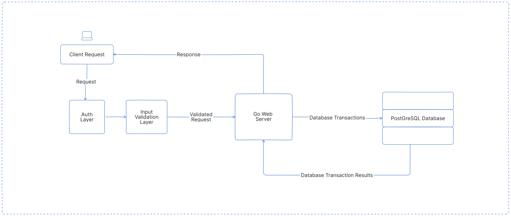

# `GO Auth Backend` 

A web server backend with complete JWT user authentication, written in GO.

## Stack

1. GO: programming language
2. JWT: authentication strategy
3. PostgreSQL: primary database
4. Render: cloud hosting platform

## Application Architecture


   
## Running locally

Before you can run the server locally, you need to create a .env file which stores most of the server's private configurations. An example env file shows all the parameters required, then the server can be run by using the command:

```bash
go run server.go
```

Alternatively, you can batch execute some pre-commands and run the server at once using make.  

Installation (Unix):

```bash
sudo apt update
sudo apt install make
```

Then run the server using:

```bash
make server
```

## Endpoints

1. domain`/`
2. domain`/auth/sign-up`
3. domain`/auth/sign-in`
4. domain`/auth/sign-out`
5. domain`/auth/oauth/google`
6. domain`/user/id`

> [!NOTE]  
> The URL and port number can be different depending on your configurations.

## 1. Sign Up
    
  All sign-up requests to the server follow this convention.
  
  ### Request
  
  ```url
  [POST] http://localhost:3000/auth/sign-up
  ```
  ### Body (JSON)
  
  ```json
  {
    "email":    "root@usr.ssh",
    "username": "root",
    "password": "rootsystemuser"
  }
  ```

  The provided password is hashed on the server. Upon successful sign-up, a response like the one below will be sent along with a token stored in the client's cookie store.
  
  ### Response

  ```json
  {
      "message": "Successfully inserted user into database",
      "success": true,
      "payload": {
          "id":       "d7407d4c-74d2-4f83-9298-99ac81565716",
          "username": "root",
          "email":    "root@usr.ssh"
      }
  }
  ```


## 2. Sign In
    
  Sign-in requests made to the server should follow this format.
  
  ### Request
  
  ```url
  [POST] http://localhost:3000/auth/sign-in
  ```
  ### Body (JSON)
  
  ```json
  {
    "email":    "root@usr.ssh",
    "password": "rootsystemuser"
  }
  ```

  On successful sign-in, the user object is returned along with a JSON Web Token for future authentication.
  
  ### Response

  A successful sign-in response looks like this:

  ```json
 {
    "message": "Successfully signed-in",
    "success": true,
    "payload": {
        "id":       "d7407d4c-74d2-4f83-9298-99ac81565716",
        "username": "user",
        "email":    "user@code.sh"
    }
}
  ```

## 3. Google Sign In
    
  The user can also sign-in with their Google accounts using OAuth
  
  ### Request
  
  ```url
  [GET] http://localhost:3000/auth/oauth/google
  ```
  
  ### Response

  A successful sign-in response looks like this:

  ```json
{
    "message": "Successfully signed-in with Google",
    "success": true,
     "payload": {
        "id":       "d7407d4c-74d2-4f83-9298-99ac81565716",
        "username": "user",
        "email":    "user@code.sh"
       }
}
  ```


## 4. Sign Out
    
  Sign-out requests expire the cookie and revokes user authorization.
  
  ### Request
  
  ```url
  [POST] http://localhost:3000/auth/sign-out
  ```
  
  ### Response

  A successful sign-in response looks like this:

  ```json
{
    "message": "Successfully signed-out",
    "success": true,
    "payload": null
}
  ```
